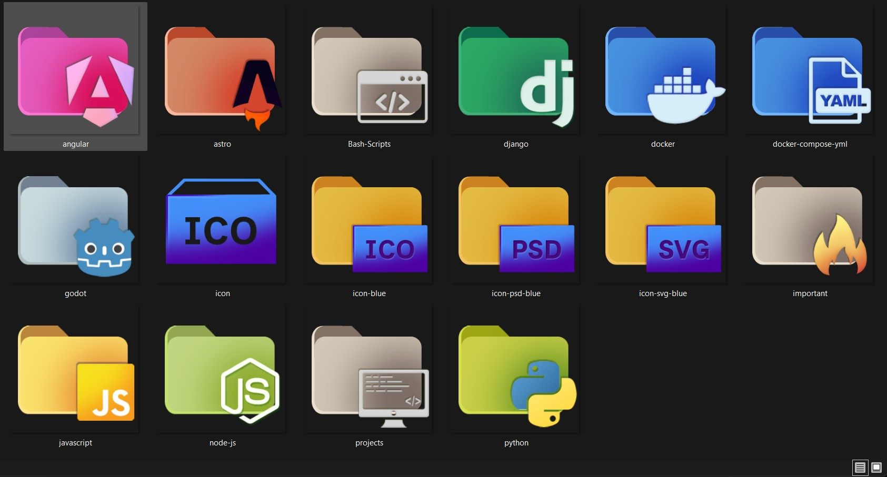

# 🗂️ Dev Folder Icons

A collection of custom folder icons for developers — designed to bring a little order and personality to your project directories.

Created with [Photopea](https://www.photopea.com/) (free online editor), inspired by the classic macOS folder aesthetic.

---

## 📦 Available Icons

| Icon | Name | Description |
|------|------|-------------|
| 🟥 | `angular` | Angular framework folder |
| 🟧 | `astro` | Astro framework folder |
| 🟫 | `Bash-Scripts` | Shell / Bash scripts folder |
| 🟩 | `django` | Django framework folder |
| 🟦 | `docker` | Docker folder |
| 🟦 | `docker-compose-yml` | Docker Compose config folder |
| ⬜ | `godot` | Godot game engine folder |
| 🟪 | `icon` | Generic icon folder |
| 🟪 | `icon-blue` | Icon folder (blue variant) |
| 🟪 | `icon-psd-blue` | PSD icon folder (blue variant) |
| 🟪 | `icon-svg-blue` | SVG icon folder (blue variant) |
| 🟨 | `important` | Important / priority folder |
| 🟨 | `javascript` | JavaScript folder |
| 🟩 | `node-js` | Node.js folder |
| 🟫 | `projects` | General projects folder |
| 🟩 | `python` | Python folder |

---

## 📁 File Format

All icons are provided as **`.ico`** files, compatible with Windows Explorer and many customization tools.

---

## 🛠️ How to Use

### Windows
1. Right-click the folder you want to customize
2. Select **Properties** → **Customize** → **Change Icon...**
3. Browse to the `.ico` file and confirm

### macOS
1. Open the `.ico` file and convert it to `.icns` using a tool like [iConvert Icons](https://iconverticons.com/)
2. Open **Finder**, select your folder
3. Press `Cmd + I` to open Get Info
4. Drag the `.icns` onto the folder icon in the top-left corner of the info window

### Linux
Depends on your file manager — most support right-clicking a folder and choosing a custom icon.

---

## ✏️ Made With

- [Photopea](https://www.photopea.com/) — free browser-based Photoshop alternative

---

## 📄 License

MIT License — free to use, modify, and distribute. See [LICENSE](LICENSE) for details.

---

## 🙌 Contributing

Found a tech stack that's missing an icon? Feel free to open an issue or submit a pull request!
